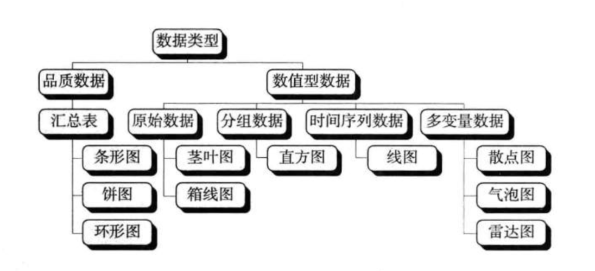

### 数据的预处理

* 数据审核
* 数据筛选
* 数据排序

**频数与频数分布**

* 频数(frequuency)是落在某一特定类别或组中的数据个数。把各个类别及落在其中的相应频数全部列出，并用表格形式表现出来，成为频数分布

**几种数据图形的展示**

* 箱型图 (box plot)是由一组数据的最大值、最小值、中位数、两个四分位数，这五个特征值，四分位数是一组数据排序后处在数据25%位置和75%位置上的两个值，下图是不同箱型图丢应的分布

  

  …...

**合理使用图表**

