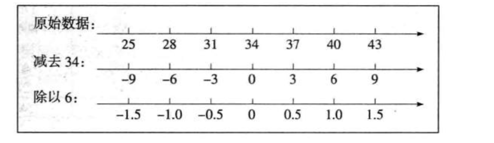
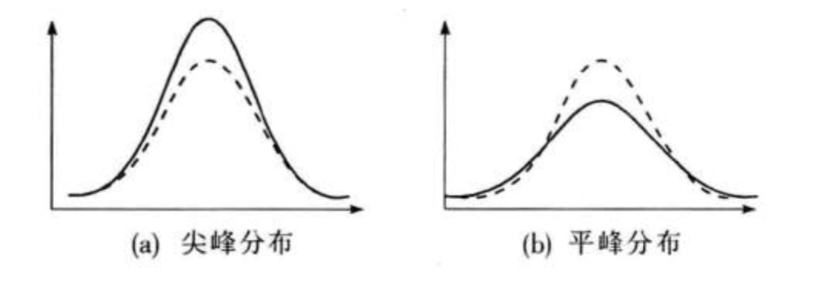
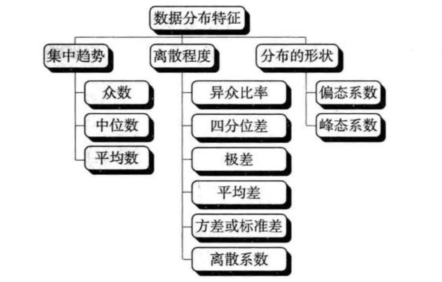

###集中趋势的度量

* **集中趋势(central tendency)**是指一组数据向某一中心值靠拢的程度，它反映了一组数据中心点的位置所在

* **众数 mode **是一组数据中出现次数最多的变量值，主要用于测度分类数据的集中趋势，当然也适用于作为顺序数据以及数值型数据集中趋势的预测值
* **中位数** 是一组数据排序后处于中间位置上的变量值

* **四分位数 quartile** 也称四分位点，它是一组数据排序后处于25%和75%位置的值。

### 离散程度的度量

* **异众比率(variation ratio)**:是指非众数组的频数占总频数的比例，用$V_{r}$表示$V_{r}=\frac{\sum f_{i}-f_{m}}{\sum f_{i}}=1-\frac{f_{m}}{\sum f_{i}}$

  异众比率主要衡量众数对一组数据的代表程度，异众比率越大，说明非众数组的频数占总频数的比重越大，众数的代表性越差

* **四分位差** 也称为 内距或四分间距(inter-quartile range),它是上四分位数与下四分位数之差，四分位差反映了50%的离散程度，其数值越大，说明中间的数据越分散。$Q_{l}=Q_{U}-Q_{L}$

* **极差**:一组数据的最大值与最小值之差称为极差(range)，也称全距用R表示$R=\max \left(x_{i}\right)-\min \left(x_{i}\right)$

* **平均差 mean deviation** 也称平均绝对离差(mean absolute deviation)，它是各变量值与其平均数离差绝对值的平均数

  * 未分组 $M_{d}=\frac{\sum_{i=1}^{n}\left|x_{i}-\bar{x}\right|}{n}$
  * 分组 $M_{d}=\frac{\sum_{i=1}^{k}\left|M_{i}-\bar{x}\right| f_{i}}{n}$

* **方差 variance**：是各变量值与其平均数离差平方的平均数。方差的平方根称为标注差(standard deviation)。方差(或标准差)能较好地反映出数据的离散程度，是实际中应用最广的离散程度测度值。$s^{2}=\frac{\sum_{i=1}^{n}\left(x_{i}-\bar{x}\right)^{2}}{n-1}$

* **标准分数** :变量值与其平均数的离差除以标准差后的值称为标准分数(standard score),也称标准化值或z分数，设标准分数为z，$z_{i}=\frac{x_{i}-\bar{x}}{s}$，标准分数给出了一组数据中各数值的相对位置

  比如一组数据，其平均数为34，标准差为6，其标准分数变换图如下

* **经验法则**
  * 当一组数据对称分布时，经验法则表明
  * 约有68%的数据在平均数 1个标准差范围之内
  * 约有95%的数据在平均数 2个标准差范围之内
  * 约有99%的数据在平均数 3个标准差范围之内
  * 在三个标准差之外的数据，在统计上称为**离群点(outlier)**
* **切比雪夫不等式**
  * 经验法适合对称分布的数据，如果一组数据不是对称分布，经验法则就不再适用，这时可使用切比雪夫不等式，它对任何分布形状的数据都适用
  * 至少有75%的数据在平均数$\pm$ 2个标准差的范围之内
  * 至少有89%的数据在平均数$\pm$ 3个标准差的范围之内
  * 至少有94%的数据在平均数$\pm$ 4个标准差的范围之内
* 相对离散程度：离散系数
  * **离散系数也称为变异系数(coefficient of  variation)**,它是一组数据的标准差与相应的平均数之比$v_{s}=\frac{s}{\bar{x}}$
    * 离散系数是测量数据离散程度的相对统计量，主要是用于比较不同样本数据的离散程度。离散系数大，说明数据的离散程度也大
    * 离散系数小，说明数据的离散程度也小

###**偏态与峰态的度量**

* **偏态及其测度**

  * 偏态(skewness)一词是由统计学家皮尔逊(K.Pearson) 于1895年首次提出的，它是对数据分布对称性的测度。测度偏态的统计量是**偏态系数** coefficient of skewness 记作SK
  * 偏态系数的计算方法有很多。根据未分组的原始数据计算偏态系数时，通常采用    $S K=\frac{n \sum\left(x_{i}-\bar{x}\right)^{3}}{(n-1)(n-2) s^{3}}$，$s^3$是样本标准差的三次方。
  * 如果一组数据的分布式是对称的，则偏态系数等于0；
  * 如果偏态系数明显不等于0，表明分布式非对称的
  * 若偏态系数大于1或小于-1，称为高度偏态分布
  * 若偏态系数在$0.5 \sim 1$ 或者 $-1 \sim -0.5$之间，被认为是中等偏态分布；偏态系数越接近0，偏斜程度就越低

* **峰态 kurtosis** 一词是由统计学家皮尔逊于1905年首次提出的。它是对数据分布平峰或尖峰程度的测度。测度峰态的统计量是**峰态系数** coefficient of kurtosis，

  * 峰态通常是与标准正太分布相比较而言的。如果一组数据服从标准正态分布，则峰态系数的值等于0；若峰态系数的值明显不等于0，则表明分布比正太分布更平，或者更尖，通常称为平峰分布或尖峰分布
  * $K=\frac{n(n+1) \sum\left(x_{i}-\bar{x}\right)^{4}-3\left[\sum\left(x_{i}-\bar{x}\right)^{2}\right]^{2}(n-1)}{(n-1)(n-2)(n-3) s^{4}}$ ，$s^4$是样本标准差的四次方
  * 公式中将离差四次方的平均数除以$s^4$是为了将峰态系数转换成相对数 ，越大越尖

* 总结

  