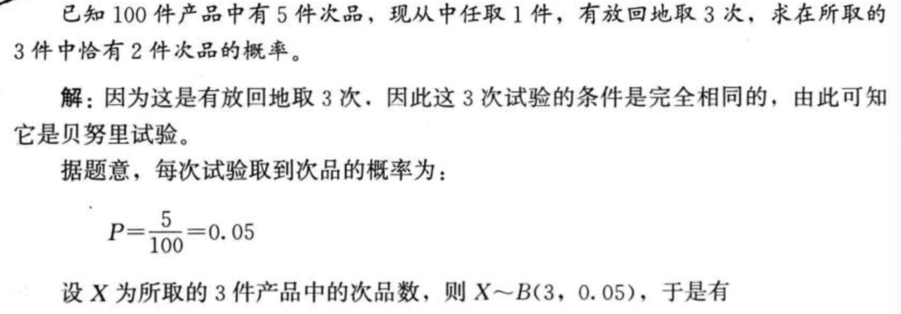

### 随机事件及其概率

* 随机事件 random event
* 必然事件 certain event
* 不可能事件 impossible event

### 概率的基本性质

* 对任一随机事件A，有$0 \leqslant P(A) \leqslant 1$

* 必然事件的概率为1，而不可能事件的概率为0，即$P(\Omega)=1 ; P(\Phi)=0$

* 若A与B互斥，则$P(A \cup B)=P(A)+P(B)$，推广到多个相互互斥的随机事件$P\left(A_{1} \cup A_{2} \cup \cdots \cup A_{n}\right)=P\left(A_{1}\right)+P\left(A_{2}\right)+\cdots+P\left(A_{n}\right)$

  

对于任意两个随机事件，它们和的概率为两个事件分别的概率之和减去两事件相交的概率，即 $P(A \cup B)=P(A)+P(B)-P(A \cap B)$

**条件概率与独立事件**

* 乘法公式：$P(A | B)=\frac{P(A B)}{P(B)}, \quad P(B)>0$，等价于$P(A B)=P(B) P(A | B)$

  

* 独立性

  * 根据事件独立性 independence的含义，由于一个事件发生与否不会影响另一个事件发生的概率，因此其条件概率应等于其无条件概率$P(B | A)=P(B)$
    $P(A | B)=P(A)$
  * 所以当两个事件相互独立时，其乘法法则可以简化为$P(A B)=P(A) P(B)$

**注意**

* 互斥事件一定是相互依赖(不独立的)
* 相互依赖的时间不一定是互斥的
* 不互斥事件可能是独立的，有可能是不独立的
* 独立事件不可能是互斥的

### 离散型随机变量及其分布

* 0-1分布
* 均匀分布 uniform distribution

**期望值**：离散型随机变量X的期望值定义为，在离散型随机变量X的一切可能值得完备组中，各可能值$x_i$ 与其对应概率$p_i$ 的乘积之和称为该随机变量X的期望值(expected value),记作 E(X) 或 $\mu$

$E(X)=x_{1} p_{1}+x_{2} p_{2}+\cdots+x_{n} p_{n}=\sum_{i=1}^{n} x_{i} p_{i}$

**方差**：随机变量的方差是用来反应随机变量取值的离散程度的。随机变量的方差定义为每一个随机变量取值与期望值的离差平方之期望值。
$$
\sigma^{2}=D(X)=E[X-E(X)]^{2}
$$
若X是离散型随机变量，则$$\sigma^{2}=D(X)=\sum_{i=1}^{\infty}\left[x_{i}-E(X)\right]^{2} p_{i}$$

**离散系数**： 标注差 / 期望

**二项分布和泊松分布**

* 二项分布  

  * 包含n个相同的试验

  * 每次试验只有两个可能的结果

  * 试验是互相独立的

  * 通常称具有上述特征的n次重复独立试验为n重贝努里试验，简称贝努里试验 (Bernoulli trials)

  * 以X表示n次重复独立试验中时间A(成功)出现的次数$P\{X=x\}=C_{n}^{x} p^{x} q^{n-x}, \quad x=0,1,2, \cdots, n$

    $\sum_{x=0}^{n} C_{n}^{x} p^{x} q^{n-x}=(p+q)^{n}=1$

    记作 $X \sim B(n, p)$

    $C_{n}^{x}=\frac{n !}{x !(n-x) !}$

    二项分布的期望值和方差分别为：

    $E(X)=n p$
    $D(X)=n p q$

    特别地当n=1时，二项分布化为：$P\{X=x\}=p^{x} q^{1-x}, \quad x=0,1$

* **泊松分布 Poisson distribution** 是用来描述在一定时间范围内或指定的面积或体积之内某一事件出现的次数的分布

  * 泊松分布的公式为：$P(X)=\frac{\lambda^{x} \mathrm{e}^{-\lambda}}{x !}, \quad x=0,1,2, \cdots$

  * $\lambda$ 为给定的时间间隔内事件的平均数

  * 泊松分布的期望值和方差分别为：

    $E(X)=\lambda$
    $D(X)=\lambda$

### 连续型随机变量的概率分布

**概率密度与分布函数**

* 由于连续型随机变量可以取某一区间或整个实数轴上的任意一个值，所以我们不能像对离散型随机变量那样，列出每一个值及其对应的概率，而必须用其他的方法，通常用数学函数的形式和分布函数的形式来描述。
* 当用f(x) 来表示连续型随机变量时，我们将f(x) 称为概率密度函数 (probability density function)
* 概率密度函数满足的条件：
  * $f(x) \geqslant 0$
  * $\int_{-\infty}^{+\infty} f(x) \mathrm{d} x=1$

 连续型随机变量的概率也可以用分布函数F(x)来表示，分布函数定义为
$$
F(x)=P(X \leqslant x)=\int_{-\infty}^{x} f(t) \mathrm{d} t, \quad-\infty<x<+\infty
$$

$$
\int_{a}^b f(x) = F(b) - F(a)
$$

显然，连续型随机变量的概率密度是其分布函数的导数，即
$$
f(x) = F'(x)
$$
连续型随机变量的期望值与方差分别定为:
$$
\begin{array}{l}{E(X)=\int_{-\infty}^{+\infty} x f(x) \mathrm{d} x=\mu} \\ {D(X)=\int_{-\infty}^{+\infty}[x-E(x)]^{2} f(x) \mathrm{d} x=\sigma^{2}}\end{array}
$$

**正态分布**

* 正态分布  normal distribution ,概率密度曲线如下

* 概率密度函数：
  $$
  f(x)=\frac{1}{\sigma \sqrt{2 \pi}} \mathrm{e}^{-\frac{1}{2 \gamma}(x-\mu)^{2}},-\infty<x<+\infty
  $$
  则称X服从正态分布，记作 
  $$
  X \sim N\left(\mu, \sigma^{2}\right)
  $$

**标准正态分布**

* 当 $\mu = 0 ,\sigma = 1$时，有 $f(x) = \frac {1}{\sqrt {2 \pi}}  e ^ {- \frac{x^2}{2}}$

$$
\begin{array}{l}{\varphi(x)=\frac{1}{\sqrt{2 \pi}} \mathrm{e}^{-\frac{x^{2}}{2}}} \\ {\Phi(x)=\int_{-\infty}^{x} \varphi(t) \mathrm{d} t=\int_{-\infty}^{x} \frac{1}{\sqrt{2 \pi}} \mathrm{e}^{-\frac{x}{2}} \mathrm{d} t}\end{array}
$$

标准正态分布的重要性在于，任何一个一般的正态分布都可以通过线性变换为标准正态分布

设 $$X \sim N\left(\mu, \sigma^{2}\right)$$，则$Z=\frac{X-\mu}{\sigma} \sim N(0,1)$

**正态分布在质量管理中的应用**

$P(\mu-3 \sigma<X<\mu+3 \sigma)=\Phi(3)-\Phi(-3)=0.9973$

$P(\mu-6 \sigma<X<\mu+6 \sigma)=\Phi(6)-\Phi(-6)=0.999999998$

 

