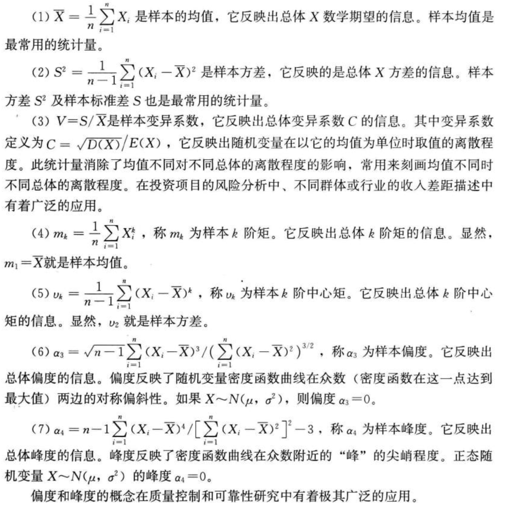
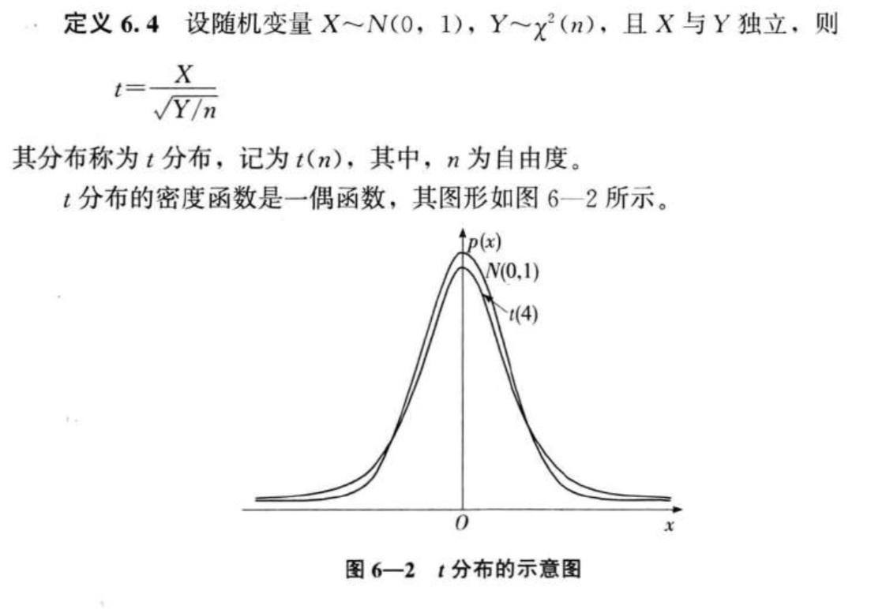

### 统计量的概念

设$X_1,X_2…,X_n$ 是从总体X中抽取的容量为n 的一个样本，如果由此样本构造一个函数$T(X_1,X_2,…,X_n)$，不依赖于任何未知参数，则称函数是一个统计量

$\begin{aligned} \bar{X} &=\frac{1}{n} \sum_{i=1}^{n} X_{i} \\ S^{2} &=\frac{1}{n-1} \sum_{i=1}^{n}\left(X_{i}-\bar{X}\right)^{2} \end{aligned}$

统计量是样本的一个函数，由样本构造具体的统计量，实际上是对样本所含的总体信息按某种要求进行加工处理，把分散在样本中的信息集中到统计量的取值上

### 几种分布

* 抽样分布：在总体X的分布类型已知时，若对任一自然数n，都能导出统计量 $T = T(X_1,X_2,X_3….,X_n$的分布的数学表达式，这种分布称为精确的抽样分布。它对样本量 n 较小的统计推断问题非常有用
* 渐近分布
* 近似分布

### 由正态分布导出的几个重要分布

* $\chi^{2}$分布
  * 自由度：独立变量的个数，例如$Y=X^2$是自由度为1的$\chi^2$分布，$Z=\sum$
  * 期望：$E(\chi^2) = n$
  * 方差：$D(\chi^2) = 2n$
  * 具有可加性  $\chi_{1}^{2}+\chi_{2}^{2} \sim \chi^{2}\left(n_{1}+n_{2}\right)$

* t分布

  * t分布也称为学生氏分布，是戈赛特于1908年在一篇以"Student"(学生)为笔名的论文中首次提出的

    

  * 当 $n \ge2 $时，t分布的数学期望 E(t) = 0

  * 当 $n \ge 3$时，t分布的方差$D(t)=\frac{n}{n-2}$

  * 自由度为1的分布称为柯西分布，随着自由度n的增加，t分布的密度函数越来越接近标准正太分布的密度函数，实际应用中，一般当$n \ge 30$时，t分布和标准正太分布就非常接近

  

* F分布

  * 在方差分析，回归方程的显著性检验中有着重要的地位

  

  

### 样本均值的分布与中心极限定理

**中心极限定理(cetral limit theorem)**:设从均值为$\mu$,方差为$\sigma^2$的任意一个总体中抽取样本量为n的样本，当 n充分大时，样本均值 $\bar{X}$ 的抽样分布近似服从均值为$\mu$、方差为 $\sigma^2 /n$的正态分布
$$
\bar {X} 的抽样分布趋于正态分布的过程
$$

在统计学中，由于正太分布有着十分重要的地位，因此常把证明其极限分布为正态分布的定理统称为中心极限定理

