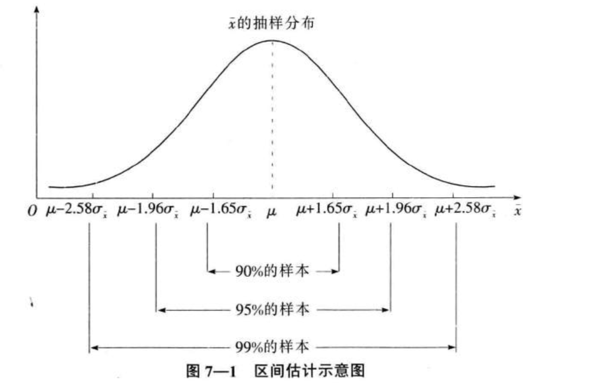
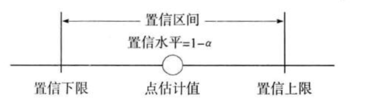
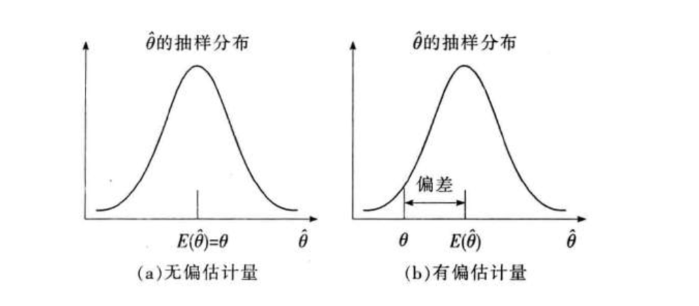
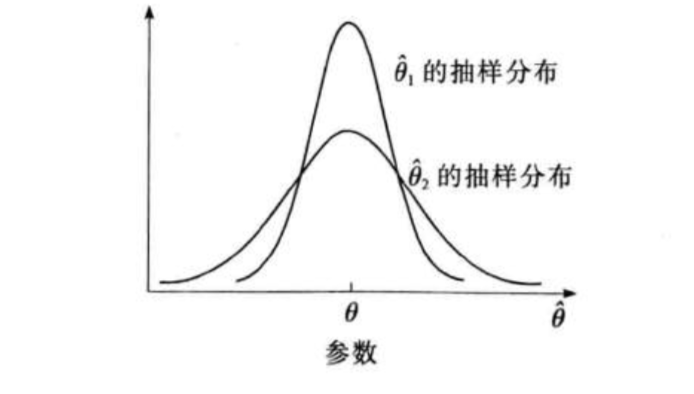
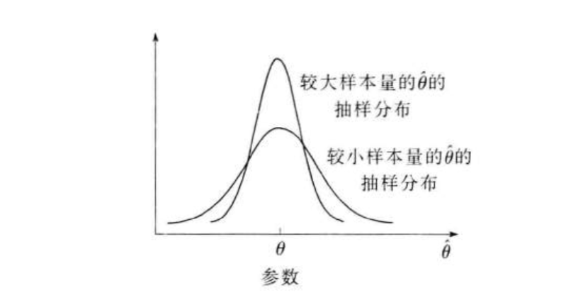
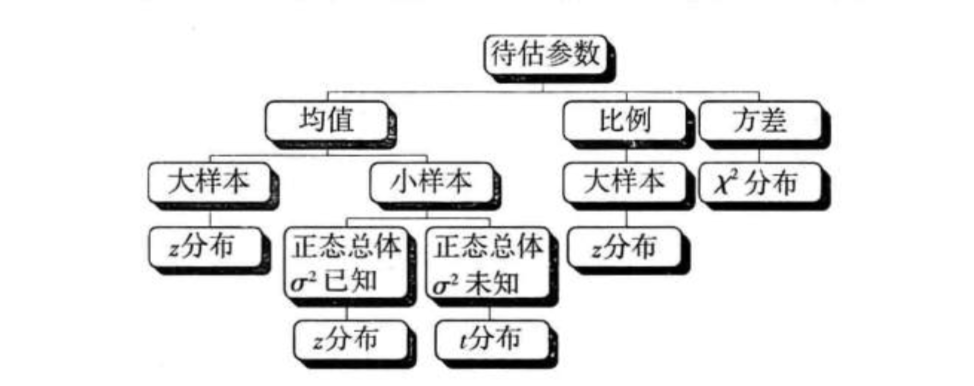

### 参数估计的基本原理

**估计量与估计值**

* 参数与估计(parameter estimation)就是用样本统计量去估计总体的参数。比如，用样本均值$\bar {x}$ 估计总体均值$\mu$ ,用样本比例$p$ 估计总体比例 $\pi$,用样本方差 $s^2$估计总体方差 $\sigma^2$
* 在参数估计中，用来估计总体参数的统计量称为估计量 estimator,用符号$\hat{\theta}$表示。
* 根据一个具体的样本计算出来的估计量的数值称为估计值(estimated value)

**点估计与区间估计**

* 点估计(point estimate)：就是用样本统计量的某个取值直接作为总体参数的估计值

* 区间估计(interval esstimate) 是在点估计的基础上，给出总体参数估计的一个区间范围，该区间通常由样本统计量加减估计误差得到。

  

  在区间估计中，由样本统计量所构造的总体参数的估计区间称为**置信区间(confidence interval )**，其中区间的最小值称为置信下限，最大值称为置信上限，置信取件中包含总体参数真值的次数所占的比例称为**置信水平(confidence level)**，也称为**置信度或置信系数** confidence coefficient

  

  置信区间的真正意义是如果做了100次抽样，大概有95次找到的区间包含真值，有5次找到的区间不包含真值

### 评价估计量的标准

* 无偏性 unbiasedness ：是指估计量抽样分布的数学期望等于被估计的总体参数。设总体参数为$\theta$,所选择的估计量为$\hat \theta$ ,如果 $E(\hat \theta) = \theta$ ,则称$\hat \theta$ 为$\theta$ 的无偏估计量
* 有效性 efficiency：一个无偏的估计量并不意味着它就非常接近被估计的参数，它还必须与总体参数的离散程度比较小
* 一致性 consistency：是指随着样本量的增大，估计量的值越来越接近被估总体的参数

