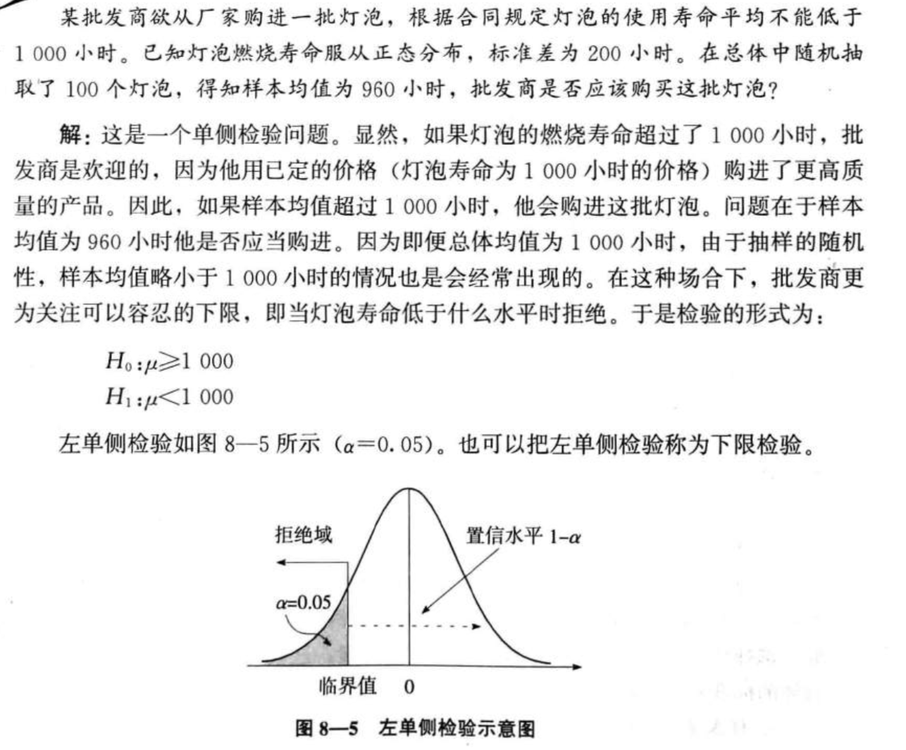

### 假设检验

 **参数估计(parameter estimation)和假设检验(hypothesis testing)**是统计推断的两个组成部分，他们都是利用样本对总体进行某种推断，但推断的角度不同

**假设检验的基本问题**

**假设的表达式**

* 统计的语言是用一个等式或不等式表示问题的原假设，在新生儿体重这个例子中，原假设采用等式的方式，即$H_{0}: \mu=3190$ (克)
* 这里$H_0$表示原假设(null hypothesis)，由于原假设(H)的下标用0表示，所以有些文献上将此称为"零假设",原假设更一般的表达式为：$H_{0}: \mu=\mu_{0}$
* **备择假设**：$H_{1}: \mu \neq \mu_{0}$
* 注意
  * 原假设与备择假设互斥
  * 肯定原假设，意味着放弃备择假设
  * 否定原假设，意味着接受备择假设

**两类错误**

* 第一类错误是原假设$H_0$为真却被我们拒绝了，犯这种错误的概率用$\alpha$表示，所以也称$\alpha$错误 或弃真错误；
* 第二类错误是原假设为伪，我们却没有拒绝，犯这种错误的概率用$\beta$表示，所以也称为$\beta$错误或取伪错误

### 假设检验的流程

1、首先提出原假设和备择假设

2、确定适当的检验统计量，并计算其数值，计算统计量类似于分数转化过程，如同把一般得分转化为标准得分 $z=\frac{\bar{x}-\mu_{0}}{\sigma / \sqrt{n}}$

…...

### 利用P值进行决策

P值就是当原假设为真时所得到的的样本观察结果或更极端结果出现的概率，如果P值很小，说明这种情况发生的概率很小，而如果出现了，根据小概率原理，我们就有理由拒绝原假设，P值越小，我们拒绝原假设的理由就越充分。

影响P值的三个因素：

* 样本数据与原假设之间的差异
* 样本量
* 被假设参数的总体分布

P值的长处是它反映了观察到的实际数据与原假设之间不一致的概率值，与传统的拒绝域范围相比，P是一个具体的值，这样就提供了更多的信息，如果事先确定了显著性水平，如$\alpha$ = 0.05,则在双侧检验中，$P > 0.025 (\alpha /2 = 0025)$不能拒绝原假设；反之，P<0.025则拒绝原假设，在单侧检验中,P>0.05不能拒绝原假设 ，P<0.05则拒绝原假设

**单侧检验**

