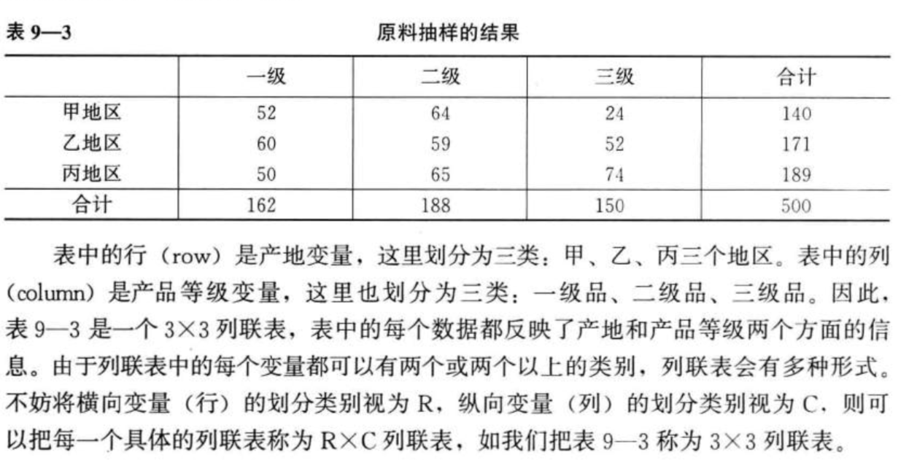
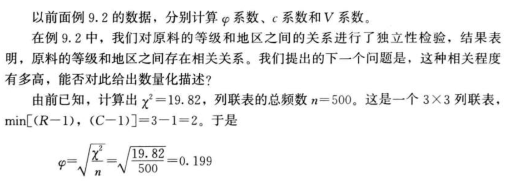

### 分类数据与$\chi^2$统计量

**$\chi ^2$统计量**

* $\chi ^2 $可以用于测定两个分类变量之间的相关程度
* 若用$f_o$表示观察值频数(observed frequency)，用$f_e$表示期望值频数(expected frequency)，则$\chi ^2$统计量写为：$\chi^2  = \sum \frac{{(f_o-f_e)}^2}{f_e}$

**$\chi ^2$统计量的特征**

* $\chi^2 \ge 0 $,因为是对平方结果的汇总
* $\chi ^2$ 统计量的分布与自由度有关
* $\chi ^2$统计量描述了观察值与期望值的接近程度
  * 两者越接近，即$f_o - f_e$的绝对值越小，计算出的$\chi ^2$值就越小，$\chi^2$检验是通过对$\chi^2$的计算结果与 $\chi ^2$分布中的临界值进行比较，做出是否拒绝原假设的统计决策

自由度越小，分布就越向左边倾斜，随着自由度的增加$\chi ^2$分布的倾斜程度趋于缓解，逐渐显露出对称性，随着自由度的继续增大，$\chi ^2$分布将趋近于对称的正态分布，利用$\chi ^2$统计量，可以对分类数据进行拟合优度检验和独立性检验

### 拟合优度检验

**拟合优度检验(goodness of fit test)** 是用$\chi ^2$统计量进行统计显著性检验的重要内容之一，它是依据总体分布情况，计算出分类变量中各类别的期望频数，与分布的观察频数进行对比，判断期望频数与观察频数是否有显著差异，从而达到对分类变量进行分析的目的

### 列联分析：独立性检验

**独立性检验**：就是分析列联表中行变量和列变量是否相互独立，也是检验各个地区和原料质量之间是否存在依赖关系。

###$\phi $相关系数

$\phi$ 相关系数(correlation coefficient)是描述 2*2列联表数据相关程度最常用的一种相关系数

$\varphi=\sqrt{\chi^{2} / n}$

**列联相关系数**

列联相关系数又称列联系数(coefficient of contingency)，简称c 系数，主要用于大于2*2 列联表的情况

c 系数的计算公式为$c=\sqrt{\frac{\chi^{2}}{\chi^{2}+n}}$

**V相关系数**

 鉴于$\phi$ 系数无上限，c系数小于1的情况，提出了V相关系数：$V=\sqrt{\frac{\chi^{2}}{n \times \min [(R-1),(C-1)]}}$

