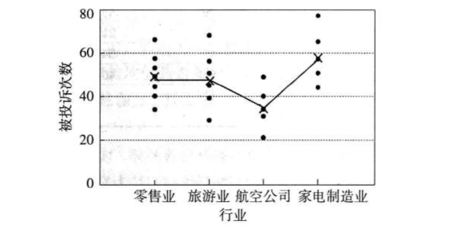
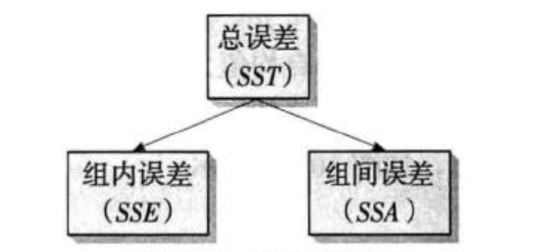

### 方差分析

**方差分析及其相关术语**

**方差分析(analysis of variance ANOVA) **：通过检验各总体的均值是否相等来判断分类自变量对数值型因变量是否有显著影响

**方差分析的基本思想和原理**

* 图像表述：画出散点图

* 误差分解：仅仅从散点图上观察还不能提供充分的证明不同行业被投诉次数之前的差异，也许这种差异是由抽样的随机性造成的，因此需要更为准备的方差分析

  * 在方差分析中，数据的误差是用平方和来表示的

  * SST：反映全部数据误差大小的平方和称为总平方和

  * SSE：反映组内误差大小的平方和称为组内平方和，也称为误差平方和或残差平方和

  * SSA：反映组间误差大小的平方和称为组间平方和

    

* 误差分析

**方差分析中的基本假定**

* 每个总体都应服从正态分布
* 各个总体的方差$\sigma^2$必须相同
* 观测值是独立的

**单因素方差分析**：当方差分析中只涉及一个分类型自变量时称为单因素方差分析(one-way analysis of variance)

**分析步骤**

* 提出假设
* 构造检验的统计量
* 统计决策
* 方差分析表