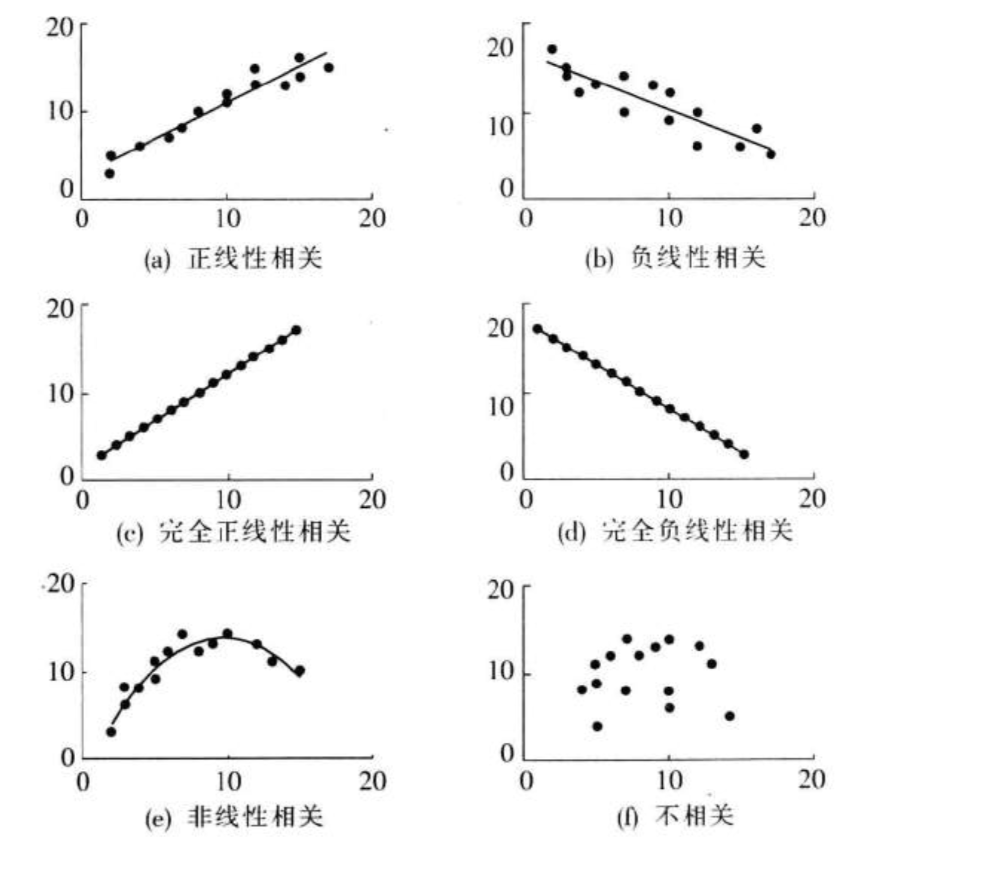
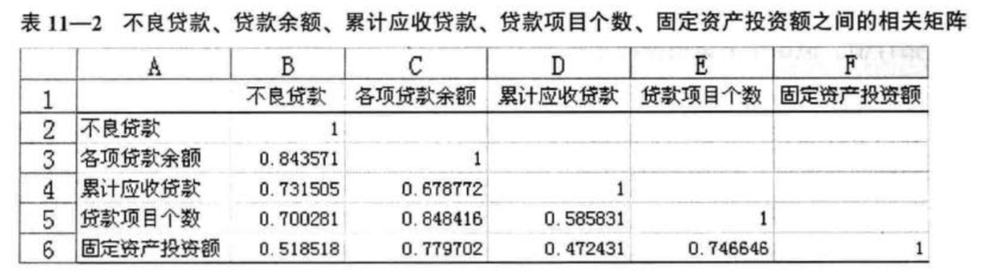
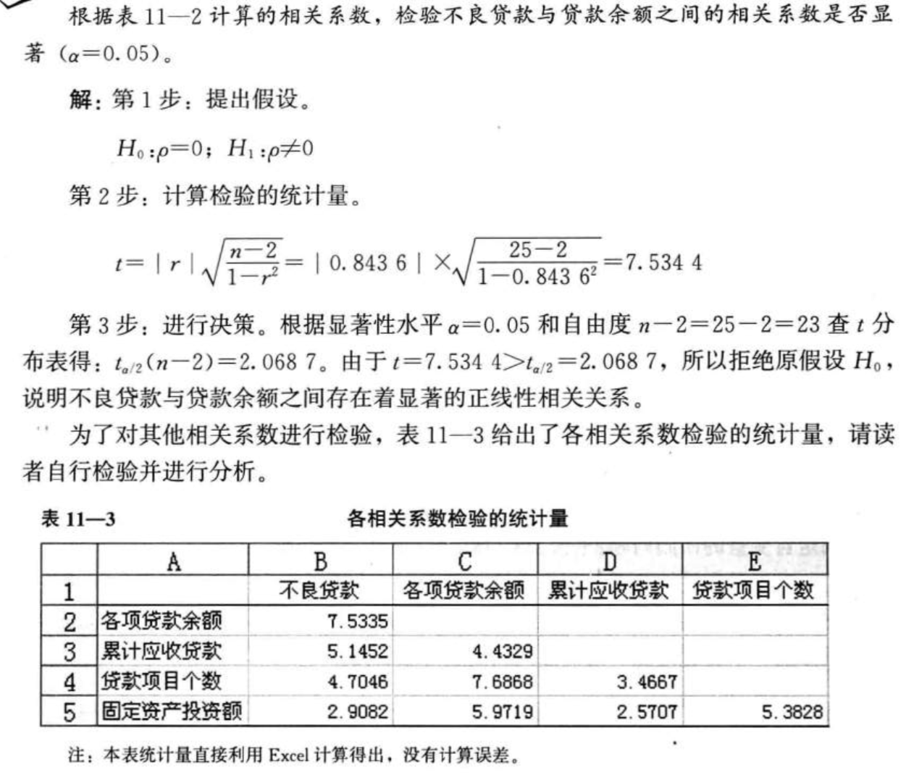
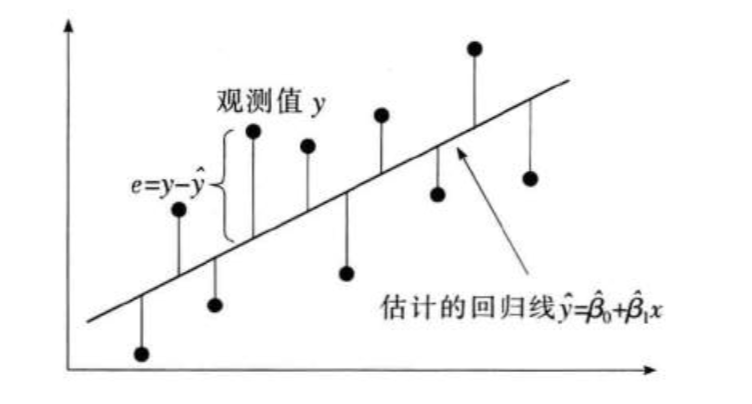

**不同形态的散点图**

**相关系数**:correlation coefficient 是根据样本数据计算的度量两个变量之间线性关系强度的统计量实时。若相关系数是根据总体全部数据计算的，称为总体相关系数，记为$\rho$；若是根据样本数据计算的，则称为样本相关系数,记为 $\gamma$

样本相关系数的计算公式为：

$\gamma=\frac{n \sum x y-\sum x \sum y}{\sqrt{n \sum x^{2}-\left(\sum x\right)^{2}} \cdot \sqrt{n \sum y^{2}-\left(\sum y\right)^{2}}}$

按上述计算公式计算的相关系数也称为线性相关系数(linear correlation coefficient),或称为**Pearson相关系数**(Pearson's correlation coefficient)

$\gamma$的取值范围是[-1,1]

若r=-1，完全负线性相关关系，r=0，说明无关

**一元线性回归**

对于具有线性关系的两个变量，可以用一个线性方程来表示它们之间的关系，描述因变量y如何依赖于自变量x和误差项$\epsilon$的方程称为**回归模型 regression model**

$y=\beta_{0}+\beta_{1} x+\varepsilon$

一元线性回归方程的形式为：$E(y)=\beta_{0}+\beta_{1} x$

估计的回归方程 estimated regression equation ： $\hat{y}=\hat{\beta}_{0}+\hat{\beta}_{1} x$

**参数的最小二乘估计**

对于第i个x值，估计的回归方程可表示为：$\hat{y}_{i}=\hat{\beta}_{0}+\hat{\beta}_{1} x_{i}$

用最小化图中垂直方向的离差平方和来估计参数$\beta _0$ 和 $\beta_1$,根据这一方法确定模型参数$\beta_0$ 和 $\beta_1$的方法称为最小二乘法，也称为最小平方法(method of least squares),它是通过使变量的观测值$y_i$ 与估计值$\hat y_i$之间的离差平方和达到最小估计$\beta_0$和$\beta_1$的方法

**详解最小二乘法：**$\sum_{i=1}^{N}(y_i-\theta^Tx_i)^2$

​		上述代价函数中使用的均方误差，其实对应了我们常用的欧几里得的距离（欧式距离，**Euclidean Distance**）, 基于均方误差最小化进行模型求解的方法称为“最小二乘法”（**least square method**），即通过最小化误差的平方和寻找数据的最佳函数匹配

​		当函数子变量为一维时，最小二乘法就蜕变成寻找一条直线，然后我们把得到的损失函数推广到n维，转换成矩阵形式

**损失函数：**

$J(\theta)=\sum_{i=1}^{N}(y_i-\theta^Tx_i)^2$

其对应的均方误差表示为如下矩阵

$J(\theta) = {(y-X\theta)^T(y-X\theta)}$

**其中X：**

$X=\begin{bmatrix} 1 && x_1^T  \\ 1 && x_2^T  \\ \cdot \\ \cdot \\ \cdot  \\ 1 && x_N^T \end{bmatrix} =\begin{bmatrix} 1 &&    x_{11} && x_{12}  && \cdot \cdot \cdot  x_{1n}  \\ 1 && x_{21} && x_{22} && \cdot \cdot \cdot x_{2n}   \\ \cdot  \\  \cdot \\ \cdot \\ 1&& x_{m1} && x_{m2}  && \cdot \cdot \cdot x_{mn}  \end{bmatrix} $

对θ求导

$J(\theta) = {(y-X\theta)^T(y-X\theta)}=y^Ty-y^Tx\theta-\theta^Tx^Ty+\theta^Tx^Tx\theta$

$\frac{\partial J(\theta)}{\partial(\theta)} = \frac{\partial y^Ty}{\partial(\theta)} - \frac{\partial y^Tx\theta}{\partial(\theta)} - \frac{\partial \theta^Tx^Ty}{\partial(\theta)} + \frac{\partial \theta^Tx^Tx\theta}{\partial(\theta)} $

$\frac{\partial J(\theta)}{\partial(\theta)} = 0-x^Ty-x^Ty+2x^Tx\theta$

$\frac{\partial J(\theta)}{\partial(\theta)} =2x^T(x\theta-y)$

根据导数的性质，该值在导数为0时为最小

所以：根据微积分定理，令上式等于零，可以得到 θ 最优的闭式解。当

$2(x^Ty-x^Tx\theta)=0$时取得最小

最终结果：$\theta = (x^Tx)^{-1}x^Ty$

### 利用回归方程进行预测

* 点估计
* 区间估计
  * 置信区间估计：它是对x的一个给定值$x_0$,求出y的平均值的估计区间，这一区间称为置信区间 confidence interval
  * 预测区间估计：它是对x的一个给定值$x_0$,求出y的一个个别值的估计区间，这一区间称为预测区间 prediction interval

